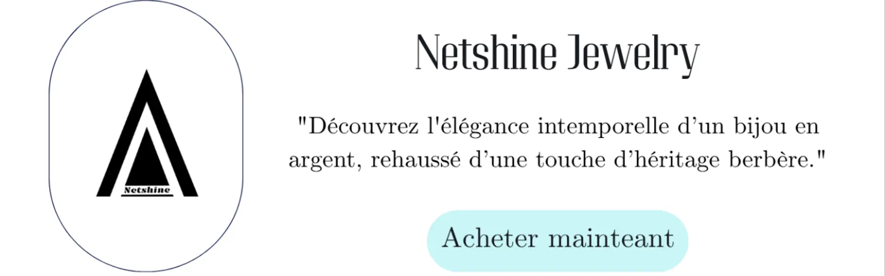

# netshine-jewelry-ecommerce

Système de gestion de boutique de bijoux avec SQL

**🌐 Site officiel de site de notre database** : (https://netshin.store/) 

**link de diagramme conceptuel de notre database** (https://app.chartdb.io/d/e5762a745ee9)
##  À propos de Netshine Jewelry <3
**Netshine Jewelry** est une boutique spécialisée dans les **accessoires et bijoux** avec une touche **amazighienne** unique.  
Elle a été fondée par une **artisane passionnée** de mon village, **Zraoua**, dans le but de proposer des créations artisanales qui allient **tradition et modernité**.   

## Objectif 
 Analyser le catalogue de produits de **Netshine Jewelry** via SQL 

- ## 🔹 Contenu du projet
-  **database/** : fichiers SQL pour créer les tables et insérer les données.  
- **queries/** : fichiers SQL avec les requêtes analytiques.

  ## 📝 Auteur

**Nom :** Hiba Mahroug   
**Rôle :** etudiante en genie logiciel passionée par DATA   
**GitHub :** [https://github.com/TaziriZaroui](https://github.com/TaziriZaroui)  
